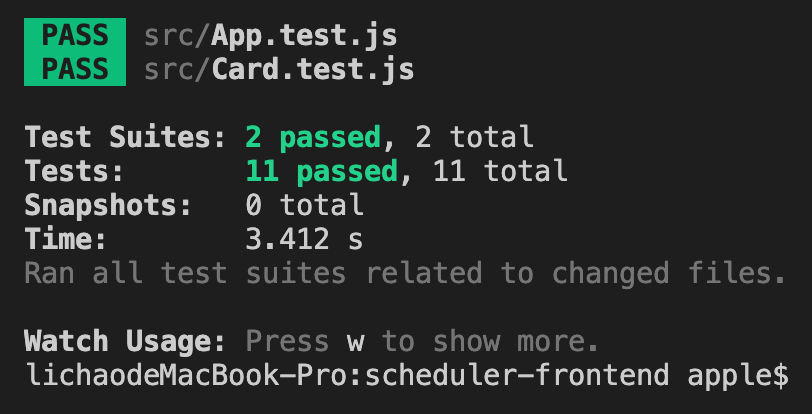

# Task Manager/Schduler Frontend

## Website is deployed on
https://jerryli-final-project-task-manager.surge.sh/

## Passing 10 Tests

## Tips for using this scheduler

- "My Schedule" Tab provides you a view of your tasks filtered by the priority levels of the task
- "Create a Task" Tab provide a form with form validation functionalities, and the added task will appear in the "My Schedule" Tab
- Try clicking on one of the grey buttons underneath the tasks, you will have a clearer view of the task information. In there, you will be able to Edit, Delete, or Add to Favorite
- Procrastinatometer detects how many tasks have imminent deadlines and gives a simple summary report
